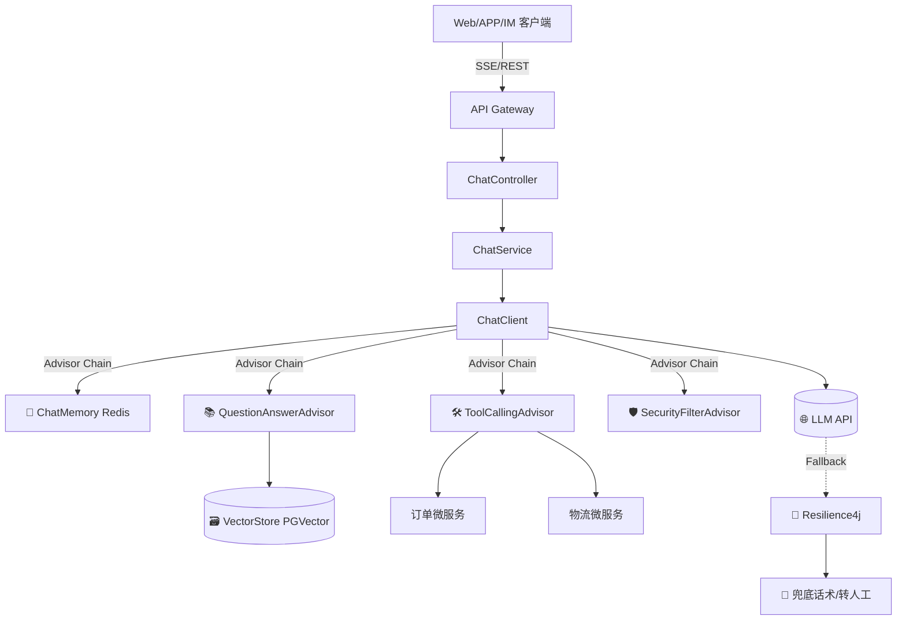

# 🤖 Spring AI 智能客服 Agent

> 基于 **Spring Boot 3.3** 与 **Spring AI 1.0+** 构建的企业级智能客服系统。支持多轮对话、RAG 知识库检索、业务工具调用、流式响应、熔断降级与安全过滤，助力企业实现 7×24 小时高效、精准的自动化客户服务。

---

## 📦 项目特性

| 模块 | 能力说明 |
|------|----------|
| 🧠 **多轮记忆** | 基于 Redis 的会话级上下文管理，支持滑动窗口与自动压缩 |
| 📚 **RAG 增强** | 向量知识库检索 + 语义问答 Advisor，精准引用企业知识 |
| 🛠️ **工具调用** | `@Tool` 声明式注册，LLM 自主决策调用订单/物流等业务 API |
| ⚡ **流式响应** | WebFlux + SSE 实现打字机效果，首字延迟 < 1s |
| 🛡️ **安全过滤** | 自定义 Advisor 拦截敏感词、Prompt 注入与越权指令 |
| 🔄 **高可用保障** | Resilience4j 熔断降级，模型异常自动切换兜底策略 |
| 📊 **可观测性** | Spring Actuator + Micrometer 埋点，支持 Token/延迟/失败率监控 |

---

## 🛠️ 技术栈

- **核心框架**：`Spring Boot 3.3` / `Spring AI 1.0+` / `Java 17`
- **通信协议**：`Spring WebFlux` (SSE 流式)
- **存储组件**：`Redis` (会话记忆) / `PostgreSQL + pgvector` (向量库)
- **治理组件**：`Resilience4j` (熔断/降级) / `Spring Actuator` (监控)
- **开发辅助**：`Lombok` / `Maven` / `Docker`

---

## 🏗️ 架构设计



---

## 🚀 快速开始

### 1️⃣ 环境准备
| 依赖 | 最低版本 | 说明 |
|------|----------|------|
| JDK | `17+` | 推荐 `Temurin` 或 `Oracle JDK` |
| Maven | `3.8+` | 构建工具 |
| Redis | `6.2+` | 会话记忆存储 |
| PostgreSQL | `14+` + `pgvector` 扩展 | 向量知识库 |
| LLM API | OpenAI 兼容接口 | 支持通义、DeepSeek、智谱等 |

### 2️⃣ 启动依赖服务 (Docker)
```bash
# 启动 Redis & PostgreSQL (pgvector)
docker run -d -p 6379:6379 redis:7-alpine
docker run -d -p 5432:5432 \
  -e POSTGRES_USER=ai \
  -e POSTGRES_PASSWORD=ai \
  -e POSTGRES_DB=customer_agent \
  ankane/pgvector:latest
```

### 3️⃣ 配置环境变量
```bash
export OPENAI_API_KEY="sk-your-api-key"
export OPENAI_BASE_URL="https://api.openai.com"  # 或国内兼容地址
export LLM_MODEL="gpt-4o-mini"                   # 或 qwen-plus, deepseek-chat
export REDIS_HOST="localhost"
export REDIS_PORT="6379"
```

### 4️⃣ 构建与运行
```bash
git clone https://github.com/your-org/spring-ai-customer-agent.git
cd spring-ai-customer-agent

mvn clean package -DskipTests
java -jar target/spring-ai-customer-agent-1.0.0.jar
```

---

## 📡 API 使用示例

### 流式对话接口
```bash
curl -X POST http://localhost:8080/api/v1/chat/stream \
  -H "Content-Type: application/json" \
  -d '{
    "sessionId": "user_20260505_001",
    "message": "我的订单号 20260501001 发货了吗？预计什么时候到？"
  }'
```

**响应示例 (SSE)**
```text
data: {"content":"您好，订单 ","sessionId":"user_20260505_001","done":false}
data: {"content":"20260501001 已发货，预计 ","sessionId":"user_20260505_001","done":false}
data: {"content":"明日送达。","sessionId":"user_20260505_001","done":false}
data: {"content":"","sessionId":"user_20260505_001","done":true}
```

---

## 📂 项目结构
```
spring-ai-customer-agent/
├── pom.xml                          # 依赖管理 (锁定 spring-ai-bom)
├── src/main/java/com/example/agent/
│   ├── CustomerAgentApplication.java
│   ├── config/
│   │   ├── AiConfig.java            # ChatClient 链式装配
│   │   └── Resilience4jConfig.java  # 熔断降级配置
│   ├── controller/
│   │   └── ChatController.java      # SSE 流式端点
│   ├── service/
│   │   └── ChatService.java         # 对话编排与异常处理
│   ├── tool/
│   │   ├── OrderTool.java           # 订单查询工具
│   │   └── LogisticsTool.java       # 物流追踪工具
│   ├── advisor/
│   │   └── SecurityFilterAdvisor.java # 安全过滤拦截器
│   └── dto/
│       ├── ChatRequest.java
│       └── ChatResponse.java
└── src/main/resources/
    └── application.yml              # 核心配置
```

---

## ⚙️ 核心配置说明 (`application.yml`)

| 配置项 | 说明 | 默认值 |
|--------|------|--------|
| `spring.ai.openai.api-key` | LLM API 密钥 | `your-key-here` |
| `spring.ai.openai.base-url` | 兼容 OpenAI 协议的网关地址 | `https://api.openai.com` |
| `spring.ai.chat.options.model` | 模型名称 | `gpt-4o-mini` |
| `spring.ai.chat.memory.max-messages` | 保留最大历史消息数 | `10` |
| `spring.ai.vectorstore.pgvector.*` | 向量库表结构与维度 | `public / 1536` |
| `resilience4j.circuitbreaker.*` | 熔断阈值与等待时间 | `50% / 30s` |

> 💡 **提示**：Spring AI 处于快速迭代期，生产环境务必通过 `spring-ai-bom` 锁定版本，避免 API 变更导致编译失败。

---

## 🏭 生产上线清单

| 模块 | 建议实践 |
|------|----------|
| **向量检索** | 切换 `Hybrid Search` (BM25 + 向量) + 重排模型，提升召回准确率 |
| **上下文管理** | 启用 `SummaryChatMemory` 自动压缩长对话，防 Token 溢出 |
| **工具调用安全** | 增加 `@Valid` 参数校验层，拒绝 LLM 生成的非法参数 |
| **成本控制** | 高频 FAQ 走本地缓存/规则引擎，仅复杂意图路由至 LLM |
| **多租户隔离** | Redis Key 加 `tenantId` 前缀，VectorStore 增加 `metadata.tenant_id` 过滤 |
| **合规审计** | 异步落盘 `session_id, prompt, response, tool_calls, latency`，满足数据安全法要求 |

---

## 📈 迭代路线图

| 阶段 | 交付内容 | 状态 |
|------|----------|------|
| `v1.0` MVP | 基础问答 + RAG + 工具调用 + 流式响应 + 熔断 | ✅ 已完成 |
| `v1.1` | 知识库自动化导入流水线 (PDF/Markdown → 向量化) | 🚧 开发中 |
| `v1.2` | 人工无缝转接 + 上下文快照 + 满意度评价收集 | 📋 规划中 |
| `v2.0` | 情感识别 + 主动触达 + 多模态图片解析 + A/B 测试路由 | 💡 规划中 |

---

## 🤝 贡献指南

1. Fork 本仓库并创建特性分支 (`git checkout -b feature/awesome-feature`)
2. 提交代码 (`git commit -m 'feat: add awesome feature'`)
3. 推送分支 (`git push origin feature/awesome-feature`)
4. 提交 Pull Request，遵循 [Conventional Commits](https://www.conventionalcommits.org/) 规范

> 📌 提交 PR 前请确保：`mvn clean test` 全部通过，且新增功能包含单元测试或集成测试用例。

---

## 📜 许可证

本项目采用 `Apache License 2.0` 开源协议。详见 [LICENSE](LICENSE) 文件。

---

## 📩 支持与反馈

- 🐛 提交 Issue：[GitHub Issues](https://github.com/shawnyang91/spring-ai-customer-agent/issues)
- 💬 技术交流群：扫码加入 Spring AI 实践社区
- 📧 商务合作：`ai-agent@yourcompany.com`

---
> 🌟 **Star 本项目**，持续获取 Spring AI 企业级落地最佳实践与架构演进方案！